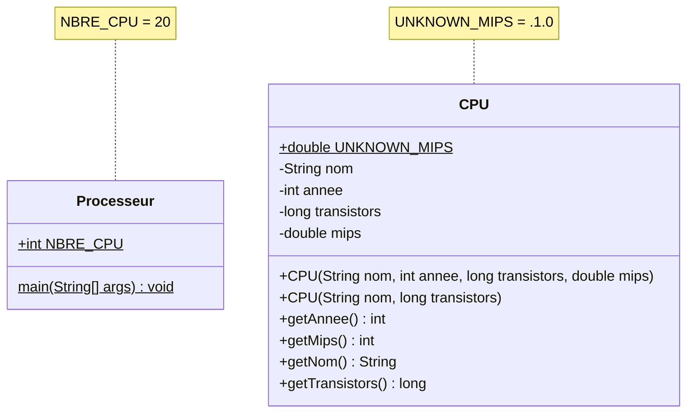
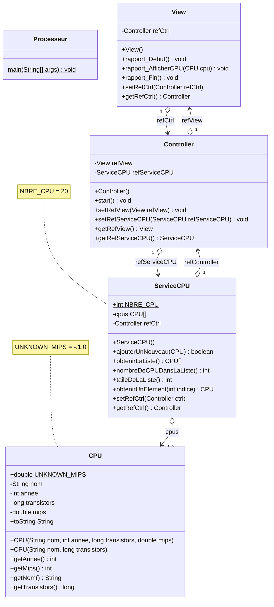
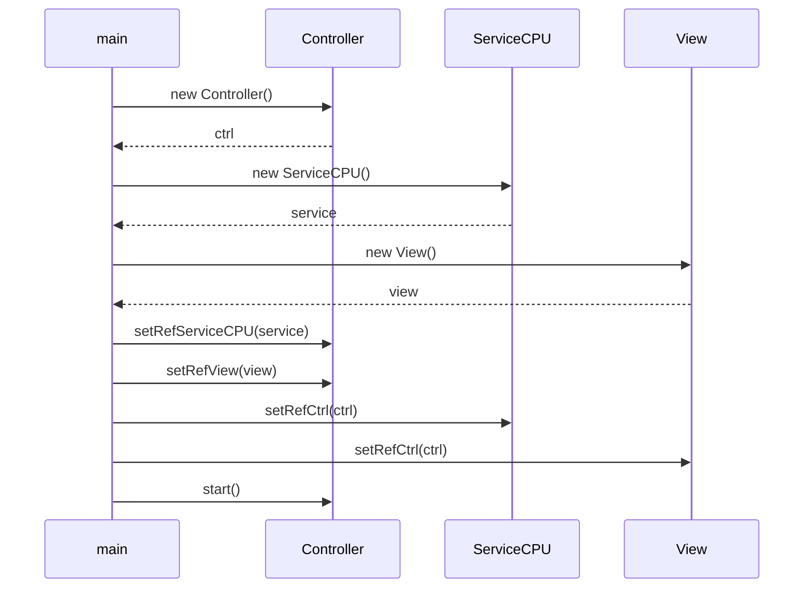
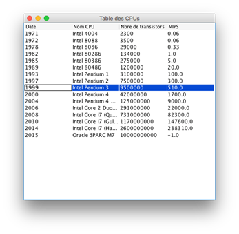
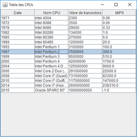

# Exercice 03 : Les Processeurs - Solution
## Durée : 210'
## Objectifs visés :
Utilisation de classes, fabrication et utilisation d‘objets, communication entre objets.

Affinage progressif de la solution :
- Partie 1 – version initiale
- Partie 2 – surcharge de toString() puis sout() direct de l’objet, découverte des littéraux
- Partie 3 – Formatage de nombres entiers et de nombres à virgule flottante
- Partie 4 – Tranformation en MVC
- Partie 5 – Changement d’Ihm sans heurts ni impacts sur le reste du projet

## PARTIE 1 : Créer la version initiale
Réalisez l’application décrite ci-après. Vous trouverez toute l’information utile directement dans ce document, sous forme de :
- diagrammes des classes => les classes à créer, leurs méthodes et attributs
- Javadoc => description précise chacune des classes, de leurs méthodes et attributs
- Portions de code => code qui vous est directement donné

### Diagramme de classes


### Javadoc
Vous pouvez cliquer sur [ce lien pour obtenir la JavaDoc en HTML](javadoc/PARTIE1/index.html) de l'application Processeur.

### Portions de code
```
/**
 * La méthode main() de l'application, là où tout commence mais... tout se finit-il bien là ?
 *
 * @param args les arguments du programme passés sur la ligne de commande
 */
public static void main( String[] args ) {

    // Créer le tableau de CPU
    CPU[] cpus = new CPU[ NBRE_CPU ];

    // Y mettre des CPUS connus
    cpus[ 0 ] = new CPU( "Intel 4004", 1971, 2300, 0.06 );
    cpus[ 1 ] = new CPU( "Intel 8088", 1972, 3500, 0.06 );
    cpus[ 2 ] = new CPU( "Intel 8086", 1978, 29000, 0.33 );
    cpus[ 3 ] = new CPU( "Intel 80286", 1982, 134000, 1 );
    cpus[ 4 ] = new CPU( "Intel 80386", 1985, 275000, 5 );
    cpus[ 5 ] = new CPU( "Intel 80486", 1989, 1200000, 20 );
    cpus[ 6 ] = new CPU( "Intel Pentium 1", 1993, 3100000, 100 );
    cpus[ 7 ] = new CPU( "Intel Pentium 2", 1997, 7500000, 300 );
    cpus[ 8 ] = new CPU( "Intel Pentium 3", 1999, 9500000, 510 );
    cpus[ 9 ] = new CPU( "Intel Pentium 4", 2000, 42000000, 1700 );
    cpus[ 10 ] = new CPU( "Intel Pentium 4 D (Prescott)", 2004, 125000000, 9000 );
    cpus[ 11 ] = new CPU( "Intel Core 2 Duo (Conroe)", 2006, 291000000, 22000 );
    cpus[ 12 ] = new CPU( "Intel Core i7 (Quad)", 2008, 731000000, 82300 );
    cpus[ 13 ] = new CPU( "Intel Core i7 (Gulftown)", 2010, 1170000000, 147600 );
    cpus[ 14 ] = new CPU( "Intel Core i7 (Haswell-E)", 2014, 2600000000L, 238310 );
    cpus[ 15 ] = new CPU( "Oracle SPARC M7", 2015, 10000000000L );

    // Passer en revue chaque CPU de notre liste
    for ( int i = 0; i < cpus.length; i++ ) {
        CPU cpu = cpus[ i ];
        // Y a-t-il un CPU à cet endroit ?
        if ( cpu != null ) {
            // Oui. Alors l'afficher !
            if ( cpu.getMips() == cpu.UNKNOWN_MIPS ) {
                System.out.println( "En " + cpu.getAnnee() + " le CPU " + cpu.getNom() + " avec " + cpu.getTransistors() + 
" transistors et une puissance de calcul inconnue." );
            } else {
                System.out.println( "En " + cpu.getAnnee() + " le CPU " + cpu.getNom() + " avec " + cpu.getTransistors() + 
" transistors et une puissance de calcul de " + cpu.getMips() + " mips." );
            }
        }
    }
}
```
## PARTIE 2 : Surchage de la méthode toString() et découverte des littéraux
Faites-en sorte qu’un objet `CPU` sache se représenter lui-même sous forme de chaîne de caractères. Pour cela, surchargez sa méthode `toString()` et implémentez-là comme précédemment (= de façon à ce qu’elle produise la même représentation textuelle qu’avant).

Depuis le `main()`, dans la boucle d’affichage des éléments de la liste, faites directement un sout de l’objet (qui saura désormais se représenter sous forme de String).

### Question(s)

Pourquoi y a-t-il un **L** majuscule à la fin des deux dernières valeurs utilisées pour exprimer le nombre de transistors ?

```
    cpus[ 14 ] = new CPU( "Intel Core i7 (Haswell-E)", 2014, 2600000000L, 238310 );
    cpus[ 15 ] = new CPU( "Oracle SPARC M7", 2015, 10000000000L );
```

Consigner votre réponse dans le fichier [REPONSES.md](REPONSES.md) et également dans votre documentation de projet.
## PARTIE 3 : Formatage de nombres entiers et de nombres à virgule flottante
Lorsqu’on affiche des objets CPU à l’écran cela donne des lignes qui ressemblent à ceci :
```
En 1971 le CPU Intel 4004 avec 2300 transistors et une puissance de calcul de 0.06 mips.
En 1972 le CPU Intel 8088 avec 3500 transistors et une puissance de calcul de 0.06 mips.
En 1978 le CPU Intel 8086 avec 29000 transistors et une puissance de calcul de 0.33 mips.
En 1982 le CPU Intel 80286 avec 134000 transistors et une puissance de calcul de 1.0 mips.
.
.
.
En 2010 le CPU Intel Core i7 (Gulftown) avec 1170000000 transistors et une puissance de calcul de 147600.0 mips.
En 2014 le CPU Intel Core i7 (Haswell-E) avec 2600000000 transistors et une puissance de calcul de 238310.0 mips.
En 2015 le CPU Oracle SPARC M7 avec 10000000000 transistors et une puissance de calcul inconnue.
```
Ce que nous aimerions, c’est un affichage plus lisible des nombres entiers et des nombres à virgule flottante, de cette manière :
```
En 1971 le CPU Intel 4004 avec 2'300 transistors et une puissance de calcul de 0.06 mips.
En 1972 le CPU Intel 8088 avec 3'500 transistors et une puissance de calcul de 0.06 mips.
En 1978 le CPU Intel 8086 avec 29'000 transistors et une puissance de calcul de 0.33 mips.
En 1982 le CPU Intel 80286 avec 134'000 transistors et une puissance de calcul de 1.00 mips.
.
.
.
En 2010 le CPU Intel Core i7 (Gulftown) avec 1'170'000'000 transistors et une puissance de calcul de 147'600.00 mips.
En 2014 le CPU Intel Core i7 (Haswell-E) avec 2'600'000'000 transistors et une puissance de calcul de 238'310.00 mips.
En 2015 le CPU Oracle SPARC M7 avec 10'000'000'000 transistors et une puissance de calcul inconnue.
```
Modifiez la surcharge de la méthode `toString()` de la classe `CPU`. Utilisez les formateurs adéquats pour formater les nombres entiers et les nombres à virgule flottante sous la forme désirée.

Testez ensuite votre programme avec soin, pas par pas avec le débogueur.
## PARTIE 4 : Transformation en MVC
Nous allons maintenant ré-écrire cette application sous une forme et une structure plus professionnelle. Vous trouverez toute l’information utile directement dans ce document, sous forme de :
- diagrammes des classes => les classes à créer, leurs méthodes et attributs
- diagrammes de séquence => la séquence d’opérations à réaliser dans certaines méthodes
- Javadoc => description précise chacune des classes, de leurs méthodes et attributs
- Portions de code => code qui vous est directement donné

### Diagramme de classes


### Structure des packages Java
Voici la structure des packages pour chaque classe du projet
```mermaid
classDiagram
namespace processeur {
    class app
    class models
    class views
    class ctrl
    class services
}
namespace app {
    class Processeur
}
namespace models {
    class CPU 
}

namespace views {
    class View
}
namespace ctrl {
    class Controller 
}
namespace services {
    class ServiceCPU 
}

```

### Diagramme de séquence
Voici le diagramme de séquence de la méthode de la méthode `main()` de la classe `Processeur` du package `app` :


### Javadoc
Vous pouvez cliquer sur [ce lien pour obtenir la JavaDoc en HTML](javadoc/PARTIE4/index.html) de l'application Processeur.

### Portions de code
Voici ci-dessous le code du `start()` de la classe `Controller` :
```
    /**
     * Méthode permettant de démarrer le contrôleur et donc la logique du programme.
     */
    public void start() {

        // Ajouter les CPUS connus
        getRefServiceCPU().ajouterUnNouveau(new CPU("Intel 4004", 1971, 2300, 0.06));
        getRefServiceCPU().ajouterUnNouveau(new CPU("Intel 8088", 1972, 3500, 0.06));
        getRefServiceCPU().ajouterUnNouveau(new CPU("Intel 8086", 1978, 29000, 0.33));
        getRefServiceCPU().ajouterUnNouveau(new CPU("Intel 80286", 1982, 134000, 1));
        getRefServiceCPU().ajouterUnNouveau(new CPU("Intel 80386", 1985, 275000, 5));
        getRefServiceCPU().ajouterUnNouveau(new CPU("Intel 80486", 1989, 1200000, 20));
        getRefServiceCPU().ajouterUnNouveau(new CPU("Intel Pentium 1", 1993, 3100000, 100));
        getRefServiceCPU().ajouterUnNouveau(new CPU("Intel Pentium 2", 1997, 7500000, 300));
        getRefServiceCPU().ajouterUnNouveau(new CPU("Intel Pentium 3", 1999, 9500000, 510));
        getRefServiceCPU().ajouterUnNouveau(new CPU("Intel Pentium 4", 2000, 42000000, 1700));
        getRefServiceCPU().ajouterUnNouveau(new CPU("Intel Pentium 4 D (Prescott)", 2004, 125000000, 9000));
        getRefServiceCPU().ajouterUnNouveau(new CPU("Intel Core 2 Duo (Conroe)", 2006, 291000000, 22000));
        getRefServiceCPU().ajouterUnNouveau(new CPU("Intel Core i7 (Quad)", 2008, 731000000, 82300));
        getRefServiceCPU().ajouterUnNouveau(new CPU("Intel Core i7 (Gulftown)", 2010, 1170000000, 147600));
        getRefServiceCPU().ajouterUnNouveau(new CPU("Intel Core i7 (Haswell-E)", 2014, 2600000000L, 238310));
        getRefServiceCPU().ajouterUnNouveau(new CPU("Oracle SPARC M7", 2015, 10000000000L));

        // Demander la taille de notre liste de CPU
        int tailleListeCPU = getRefServiceCPU().tailleDeLaListe();

        // Demander le nombre d'éléments contenus dans notre liste
        int nbreElementsDansListeCPU = getRefServiceCPU().nombreDeCPUDansLaListe();

        // Débuter un nouveau rapport pour l'utilisateur
        getRefView().rapport_Debut();

        // Passer en revue chaque CPU de notre liste
        for (int i = 0; i < tailleListeCPU; i++) {
            // Mettre la main sur ce CPU-là
            CPU cpu = getRefServiceCPU().obtenirUnElement(i);
            // Y a-t-il un CPU ?
            if (cpu != null) {
                // Oui. Alors l'afficher !
                getRefView().rapport_AfficherCPU(cpu);
            }
        }

        // Terminer le nouveau rapport pour l'utilisateur
        getRefView().rapport_Fin();
    }
```

## PARTIE 5 : Changement d’Ihm

Un des bienfaits de l’architecture MVC c’est qu’on peut changer la façon de travailler (le service) ou la façon de représenter les informations à l’utilisateur (la view) sans impacts pour le reste du projet Java.

Pour le démontrer, remplacez le code de la view par le code ci-dessous. Essayez ensuite l’application:
```
package processeur.views;

import java.util.ArrayList;
import javax.swing.JFrame;
import javax.swing.JScrollPane;
import javax.swing.JTable;
import javax.swing.SwingUtilities;

import processeur.ctrl.Controller;
import processeur.models.CPU;

/**
 * Vue principale MVC de l'application "Processeur".
 *
 * @author <a href="mailto:friedlip@edufr.ch">Paul Friedli</a>
 * @since 18 octobre 2023
 * @version 0.1
 */
public class View {

    /**
     * Référence au contrôleur MVC de notre application.
     */
    private Controller refCtrl;

    /**
     * Les données contenues dans la table qui sera affichée à l'utilisateur.
     */
    private ArrayList<CPU> data;
    /**

     * Constructeur de notre ihm principale MVC de l'application "Processeur".
     */
    public View() {
        this.refCtrl = null;
    }

    /**
     * Cette méthode permet de débuter un nouveau rapport qui sera affiché à l'utilisateur.
     */
    public void rapport_Debut() {
        // Créer/vider les données affichées à l'utilisateur
        data = new ArrayList<CPU>();
    }

    /**
     * Cette méthode permet d'ajouter une ligne au rapport des CPU qui sera affiché à l'utilisateur.
     *
     * @param cpu le CPU à afficher à l'utilisateur
     */
    public void rapport_AfficherCPU( CPU cpu ) {
        data.add( cpu );
    }

    /**
     * Cette méthode permet de terminer le nouveau rapport qui sera affiché à l'utilisateur.
     */
    public void rapport_Fin() {
        // Maintenant il faut afficher la table...
        SwingUtilities.invokeLater( new Runnable() {
            @Override
            public void run() {
                new TableDeCPUs();
            }
        } );
    }

    private class TableDeCPUs extends JFrame {

        public TableDeCPUs() {
            // Entêtes pour la table
            String[] colonnes = new String[] { "Date", "Nom CPU", "Nbre de transistors", "MIPS" };

            // Les données de la table
            Object[][] objectData = new Object[ data.size() ][ 4 ];
            for ( int i = 0; i < data.size(); i++ ) {
                CPU cpu = data.get( i );
                objectData[ i ][ 0 ] = cpu.getAnnee();
                objectData[ i ][ 1 ] = cpu.getNom();
                objectData[ i ][ 2 ] = cpu.getTransistors();
                objectData[ i ][ 3 ] = cpu.getMips();
            }

            // Créer la table avec les données
            JTable table = new JTable( objectData, colonnes );

            //add the table to the frame
            this.add( new JScrollPane( table ) );

            this.setTitle( "Table des CPUs" );
            this.setDefaultCloseOperation( JFrame.EXIT_ON_CLOSE );
            this.pack();
            this.setVisible( true );
            this.setLocationRelativeTo( null );
        }
    }

    /**
     * Setter de la référence au contrôleur de l'application MVC "Processeur".
     *
     * @param refCtrl référence au contrôleur de l'application MVC "Processeur"
     */
    public void setRefCtrl( Controller refCtrl ) {
        this.refCtrl = refCtrl;
    }

    /**
     * Getter de la référence au contrôleur de l'application MVC "Processeur".
     *
     * @return la référence au contrôleur de l'application MVC "Processeur"
     */
    public Controller getRefCtrl() {
        return refCtrl;
    }

}
```

Bravo : vous venez de tranformer votre application qui affiche désormais les informations dans un tableau Swing minimaliste.

Voici à quoi cela devrait ressembler :
| Sur Windows | Sur Mac |
| :----: | :----: |
|  |  |

