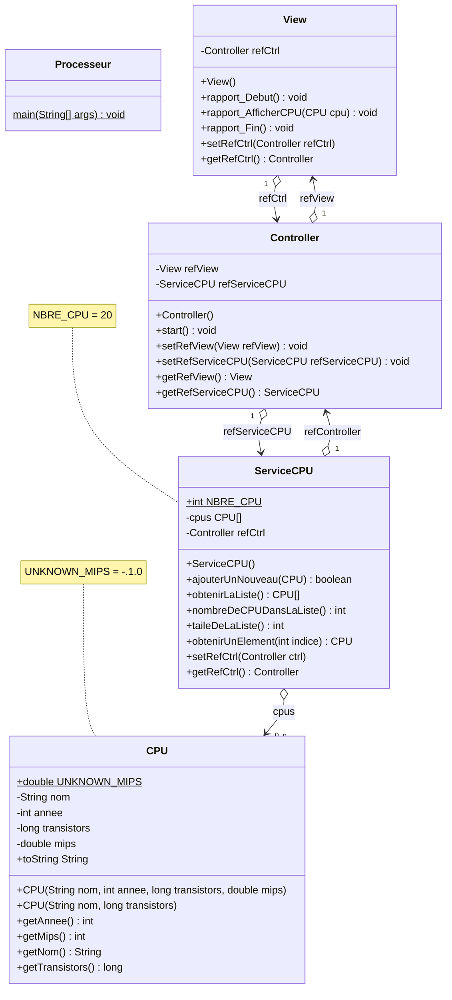
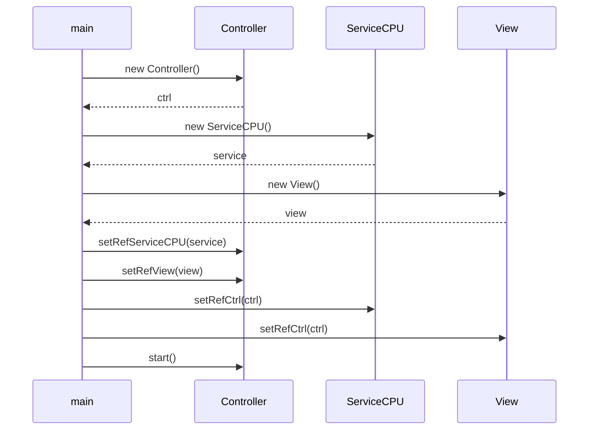

# Exercice 03 : Les Processeurs B - Solution
## Durée : 90'
## Objectifs visés :
Transformation MVC de la solution processeurs

Affinage progressif de la solution :
- Partie 1 – Tranformation en MVC
- Partie 2 – Changement d’Ihm sans heurts ni impacts sur le reste du projet

## PARTIE 1 : Transformation en MVC
Nous allons maintenant ré-écrire cette application sous une forme et une structure plus professionnelle. Vous trouverez toute l’information utile directement dans ce document, sous forme de :
- diagrammes des classes => les classes à créer, leurs méthodes et attributs
- diagrammes de séquence => la séquence d’opérations à réaliser dans certaines méthodes
- Javadoc => description précise chacune des classes, de leurs méthodes et attributs
- Portions de code => code qui vous est directement donné

> La classe `CPU` doit être reprise intégralement de l'exercice précédent `Ex03-ProcesseursA`. Copier la classe CPU dans ce nouveau projet.

### Diagramme de classes


### Structure des packages Java
Voici la structure des packages pour chaque classe du projet
```mermaid
classDiagram
namespace processeur {
    class app
    class models
    class views
    class ctrl
    class services
}
namespace app {
    class Processeur
}
namespace models {
    class CPU 
}

namespace views {
    class View
}
namespace ctrl {
    class Controller 
}
namespace services {
    class ServiceCPU 
}

```

### Diagramme de séquence
Voici le diagramme de séquence de la méthode de la méthode `main()` de la classe `Processeur` du package `app` :


### Javadoc
La Javadoc se trouve directement dans les classes Java. Il ne vous reste plus qu'à remplacer les commentaires `// VOTRE CODE ICI...`

### Portions de code
La méthode `start()` de la classe `Controller` vous est donnée.

## PARTIE 2 : Changement d’Ihm

Un des bienfaits de l’architecture MVC c’est qu’on peut changer la façon de travailler (le service) ou la façon de représenter les informations à l’utilisateur (la view) sans impacts pour le reste du projet Java.

Pour le démontrer, remplacez le code de la view par le code ci-dessous. Essayez ensuite l’application:
```
package processeur.views;

import java.util.ArrayList;
import javax.swing.JFrame;
import javax.swing.JScrollPane;
import javax.swing.JTable;
import javax.swing.SwingUtilities;

import processeur.ctrl.Controller;
import processeur.models.CPU;

/**
 * Vue principale MVC de l'application "Processeur".
 *
 * @author <a href="mailto:friedlip@edufr.ch">Paul Friedli</a>
 * @since 18 octobre 2023
 * @version 0.1
 */
public class View {

    /**
     * Référence au contrôleur MVC de notre application.
     */
    private Controller refCtrl;

    /**
     * Les données contenues dans la table qui sera affichée à l'utilisateur.
     */
    private ArrayList<CPU> data;
    /**

     * Constructeur de notre ihm principale MVC de l'application "Processeur".
     */
    public View() {
        this.refCtrl = null;
    }

    /**
     * Cette méthode permet de débuter un nouveau rapport qui sera affiché à l'utilisateur.
     */
    public void rapport_Debut() {
        // Créer/vider les données affichées à l'utilisateur
        data = new ArrayList<CPU>();
    }

    /**
     * Cette méthode permet d'ajouter une ligne au rapport des CPU qui sera affiché à l'utilisateur.
     *
     * @param cpu le CPU à afficher à l'utilisateur
     */
    public void rapport_AfficherCPU( CPU cpu ) {
        data.add( cpu );
    }

    /**
     * Cette méthode permet de terminer le nouveau rapport qui sera affiché à l'utilisateur.
     */
    public void rapport_Fin() {
        // Maintenant il faut afficher la table...
        SwingUtilities.invokeLater( new Runnable() {
            @Override
            public void run() {
                new TableDeCPUs();
            }
        } );
    }

    private class TableDeCPUs extends JFrame {

        public TableDeCPUs() {
            // Entêtes pour la table
            String[] colonnes = new String[] { "Date", "Nom CPU", "Nbre de transistors", "MIPS" };

            // Les données de la table
            Object[][] objectData = new Object[ data.size() ][ 4 ];
            for ( int i = 0; i < data.size(); i++ ) {
                CPU cpu = data.get( i );
                objectData[ i ][ 0 ] = cpu.getAnnee();
                objectData[ i ][ 1 ] = cpu.getNom();
                objectData[ i ][ 2 ] = cpu.getTransistors();
                objectData[ i ][ 3 ] = cpu.getMips();
            }

            // Créer la table avec les données
            JTable table = new JTable( objectData, colonnes );

            //add the table to the frame
            this.add( new JScrollPane( table ) );

            this.setTitle( "Table des CPUs" );
            this.setDefaultCloseOperation( JFrame.EXIT_ON_CLOSE );
            this.pack();
            this.setVisible( true );
            this.setLocationRelativeTo( null );
        }
    }

    /**
     * Setter de la référence au contrôleur de l'application MVC "Processeur".
     *
     * @param refCtrl référence au contrôleur de l'application MVC "Processeur"
     */
    public void setRefCtrl( Controller refCtrl ) {
        this.refCtrl = refCtrl;
    }

    /**
     * Getter de la référence au contrôleur de l'application MVC "Processeur".
     *
     * @return la référence au contrôleur de l'application MVC "Processeur"
     */
    public Controller getRefCtrl() {
        return refCtrl;
    }

}
```

Bravo : vous venez de tranformer votre application qui affiche désormais les informations dans un tableau Swing minimaliste.

Voici à quoi cela devrait ressembler :
| Sur Windows | Sur Mac |
| :----: | :----: |
|  |  |

